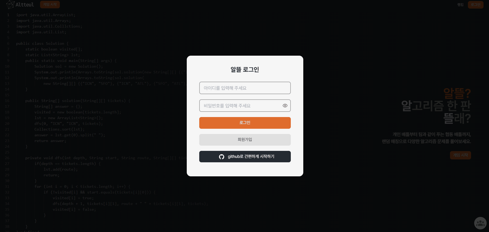
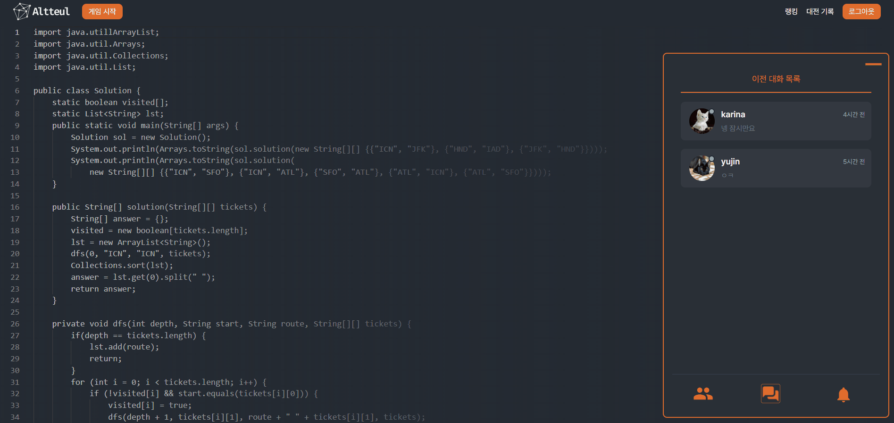

## 💡 프로젝트 소개


### ⚙ 개요

- 진행 기간 : 2025/1/13 ~ 2024/2/20
- 소개 : 알고리즘 배틀 사이트

### ⚙ 기획 배경

- 혼자 알고리즘 문제를 풀었을 때 느끼는 답답함을 누군가와 공유하고 싶다는 아이디어에서 착안
- 단순히 코드만 공유할 수 있는 협업 툴이 아니라 함께 문제를 풀고 경쟁하며 성장할 수 있는 서비스로 구체화 


### ⚙ 팀 구성

|         |      포지션      |                                     역할                                      |
|:-------:|:-------------:|:---------------------------------------------------------------------------:|
| **김덕진** |    FE, 팀장     |                    팀전/개인전 매칭, 게임 초대, 친구 신청, 채팅, 회원 정보 수정                    |
| **박가희** |   FE, FE 리더   | 메인, 대전 기록, 팀전/개인전 IDE, 코드 제출 및 실행, 보너스 문제, 아이템, OpenVidu로 음성 공유, AI 코칭, 디자인 |
| **장희현** |      FE       |          로그인, 로그아웃, 디자인, 채팅 모달 일부, 공통 컴포넌트 제작, 에러 페이지, PPT, 영상 제작           |
| **진우석** | FE, BE, BE 리더 |                회원, 코드 공유, 채점 서버 연동, 게임 결과 반환, 랭킹 페이지 조회 및 검색                |
| **김성찬** |      BE       |                친구 신청, 채팅, OpenVidu 서버 배포, 유저 검색, 팀전/개인전 나가기                 |
| **김시아** |      BE       |               팀전/개인전 매칭, 게임 초대, 랭킹 데이터 처리 및 페이지 조회/검색 , S3 연동               |

<br>

### ⚙ 개발 환경 및 기술


### ⚙ API 명세서


### ⚙ 기능 명세서

https://jumbled-hexagon-bd2.notion.site/19d56f9141d380a0a351f11a57e5c701?pvs=4

### ⚙ ERD

https://www.erdcloud.com/d/4NDsDbCnsSfs4cGsh

### ⚙ 아키텍처


## 🆚 서비스 소개

### ⚙ 회원가입


|                                                   |                                                   |
|---------------------------------------------------|---------------------------------------------------|
|                |  |
| 일반 회원가입                                           | 깃허브 회원가입                                          |


### ⚙ 로그인



- JWT, Spring Security 활용

### ⚙ 유저페이지


- 대전 기록 열람 가능
- 해당 유저의 등수, 등급, 상위 분포 확인 가능
- 플레이 시간, 함께 게임한 유저, 제출한 코드의 실행 시간 및 메모리, 문제 정보 확인 가능 


### ⚙ 친구 맺기

|                                                    |                                      |
|----------------------------------------------------|--------------------------------------|
|  |  |
| 친구 신청                                              | 친구 삭제                                |


- WebSocket을 통해 친구 신청 시 상대방에게 실시간으로 알람 생성 
- WebSocket, Redis를 통해 친구의 온라인/오프라인 상태 확인
- 친구 신청을 위한 유저 검색 기능 제공 


### ⚙ 채팅

|                                           |                                         |
|-------------------------------------------|-----------------------------------------|
|  |  |
| 채팅방 조회                                    | 실시간 채팅                                  |

- 가장 최근 채팅 메시지가 채팅방 목록에 함께 노출

### ⚙ 랭킹 페이지

|                                                 |                                         |
|-------------------------------------------------|-----------------------------------------|
|  |  |
| 비로그인 회원                                         | 로그인 회원                                  |


- 매일 자정에 Spring Batch로 업데이트되는 데일리 랭킹 데이터를 렌더링
- 유저별 순위, 순위 변동, 랭킹 점수, 선호 언어, 평균 통과율 확인 가능 
- 닉네임, 등급별, 언어 별 검색 기능 제공 
- 로그인한 회원의 경우 본인의 등급이 첫 번째에 위치

### ⚙ 개인전 매칭

|                                                       |                                                                     |
|-------------------------------------------------------|---------------------------------------------------------------------|
|  |  |
| 매칭 후 게임 화면으로 이동                                       | 방 나가기                                                               |


- 최소 2명, 최대 8명 게임 가능
- redis를 통해 대기방 상태 및 소속된 유저들 관리
- 게임 시작 시 redis에서 관리하던 데이터를 DB에 저장

### ⚙ 개인전 배틀

|                                                   |                                                     |
|---------------------------------------------------|-----------------------------------------------------|
|  |  |
| 코드 작성                                             | 코드 실행                                               |
|  | -                                                   |
| 코드 제출 및 결과                                        | -                                                   


- 실시간으로 상대의 테스트케이스 통과 현황 파악 가능

### ⚙ 팀전 매칭

|                                                   |                                                                 |
|---------------------------------------------------|-----------------------------------------------------------------|
|  |  |
| 매칭 후 게임 화면으로 이동                                   | 매칭 취소                                                           |
|    |    |
| 매칭 완료                                             | 방 나가기                                                           


- 최소 2명, 최대 4명 게임 가능 
- redis를 통해 대기방 상태 및 소속된 유저들 관리
- 게임 시작 시 redis에서 관리하던 데이터를 DB에 저장 


### ⚙ 팀전 게임 초대

|                                     |                                                   |
|-------------------------------------|---------------------------------------------------|
|  |  |
| 초대 승인                               | 초대 거절                                             |


- 친구 초대 시 실시간 알람 전송
- 실시간으로 이루어지는 게임 특성 상 Redis TTL을 10분으로 설정하여 유효기간 지정

### ⚙ 팀전 배틀

|                                               |                                                 |
|-----------------------------------------------|-------------------------------------------------|
|  |  |   
| 동시 코드 작성                                      | 상대팀 코드 블러 처리                                    |
|        |     |
| 보너스 문제 및 아이템 자동 적용                            | 코드 실행                                      |
| |   
|  코드 제출 및 결과                                |    AI 코칭

- 실시간으로 상대의 테스트케이스 통과 현황 파악 가능
- 상대 팀의 IDE를 블러 처리한 상태로 노출
- 같은 팀끼리 실시간 코드 공유 가능
- OpenVidu를 통해 같은 팀끼리 음성 채팅 가능
- OpenAI를 통해 제출한 코드에 대해 피드백 제공


## 📄 PR Template

```declarative
<!-- PR 메시지 : 🔀 [FE] merge: from feature/ to dev  -->

## 개요
### 🔀 [FE] merge: from feature/ to dev 
<!---- 변경 사항 및 관련 이슈에 대해 간단하게 작성해주세요. 어떻게보다 무엇을 왜 수정했는지 설명해주세요. -->

<!---- Resolves: #(Issue Number) -->

## PR 유형
어떤 변경 사항이 있나요?

- [ ] 기능 및 코드 추가
- [ ] 기능 및 코드 수정중
- [ ] 기능 및 코드 수정 완료
- [ ] 버그 수정
- [ ] 디자인 수정
- [ ] 코드 리팩토링
- [ ] 문서작성 및 편집
- [ ] config 파일 수정
- [ ] 파일 추가
- [ ] 파일 제거
- [ ] 오타 수정
- [ ] 성능 향상
- [ ] public 폴더 업데이트
- [ ] 프로젝트 구조 변경
- [ ] 치명적인 버그 수정
- [ ] 프로젝트 개시
- [ ] 프로젝트 배포

## PR Checklist
PR이 다음 요구 사항을 충족하는지 확인하세요.

- [ ] 커밋 메시지 컨벤션에 맞게 작성했습니다.
- [ ] 변경 사항에 대한 테스트를 했습니다.(버그 수정/기능에 대한 테스트).
```

## ⚠️ Commit Convention

```declarative
- feat : 새로운 기능 추가
- fix : 버그 수정
- docs : 문서 수정
- style : 코드 포맷팅, 세미콜론 누락, 코드 변경이 없는 경우
- refactor : 코드 리팩토링
- test : 테스트 코드, 리펙토링 테스트 코드 추가
- chore : 별도 업무 수정, 패키지 매니저 수정
```